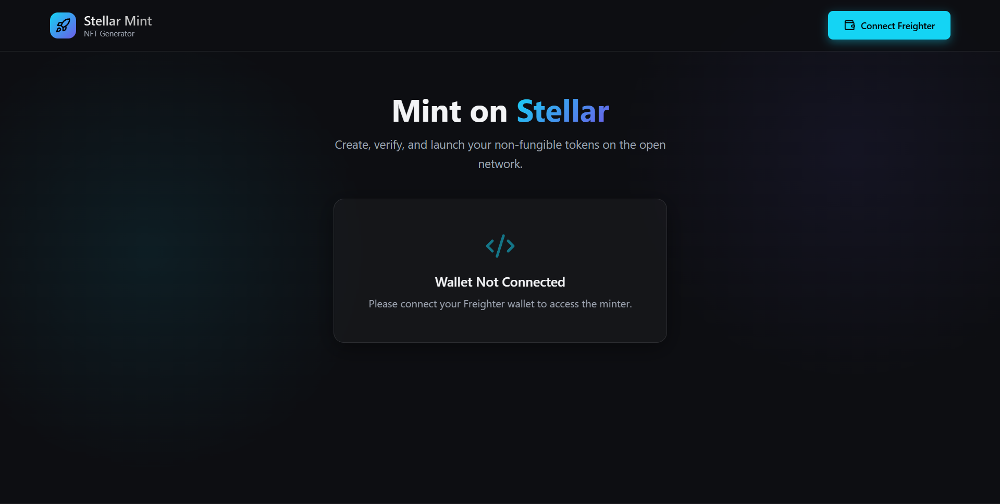
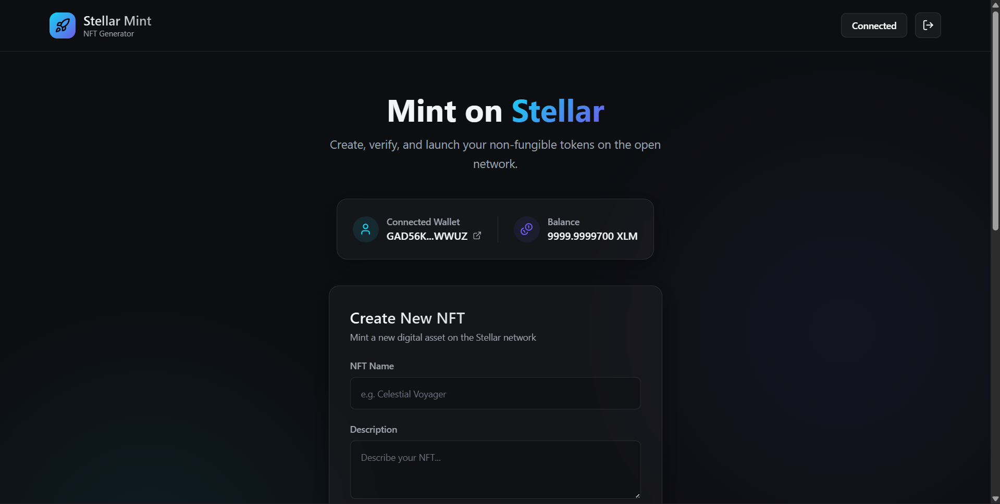
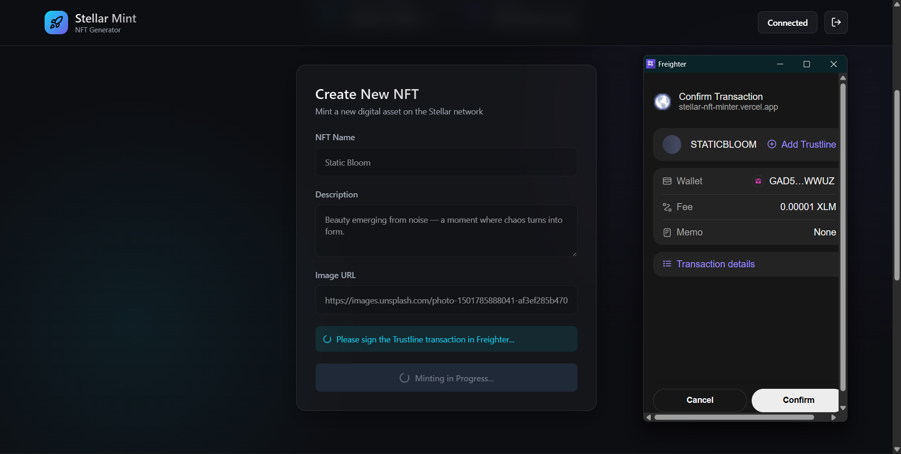
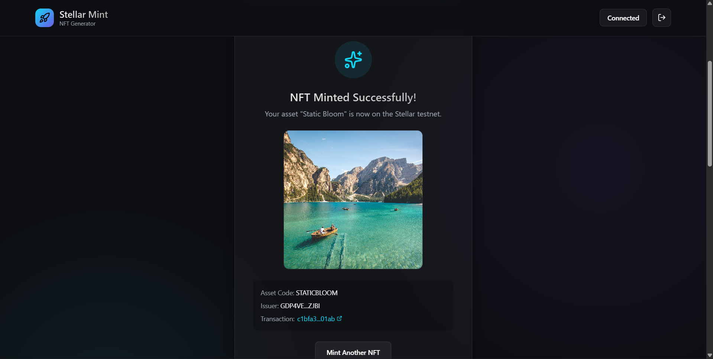
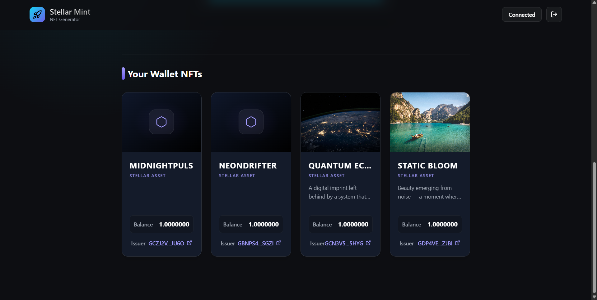

# Stellar NFT Minter

🚀 **Stellar NFT Minter** is a clean, modern, and professional decentralized application (dApp) built explicitly on the robust Stellar network. It enables users to effortlessly securely mint Non-Fungible Tokens (NFTs) natively using precisely locked Stellar Custom Assets!

Built heavily with a premium Tailwind CSS aesthetic, the platform abstracts strictly away the complexity of blockchain interactions, allowing creators to connect their Freighter wallet, identically issue uniquely locked assets, and instantly view their transactions mapped directly against the Stellar Expert Block Explorer.

## 🌟 Features

- **Freighter Wallet Integration**: Secure and seamless connection flow using `@stellar/freighter-api` mapping session local storage logic naturally.
- **Live On-Chain Minting**: True Stellar Custom Asset generation securely generating random issuer keypairs comprehensively mapped and passively funded via Testnet Friendbot.
- **Granular Status Tracking**: Sleek real-time progress updates keeping you informed across network interactions natively checking Freighter signature requests.
- **Session Gallery Ecosystem**: Automatically tracks precisely and elegantly displays a responsive grid layout of your beautifully minted NFTs securely caching off-chain metadata attributes natively within the session state cleanly.
- **Premium UI/UX**: Constructed fully strictly utilizing Tailwind CSS v3 structurally featuring beautiful pristine glassmorphism gradients hovering natively over explicit micro loading animators.

## 🛠 Tech Stack

- **Framework**: React 19 / Vite
- **Styling**: Tailwind CSS v3
- **Network Bridges**: `stellar-sdk`, `@stellar/freighter-api`
- **Iconography**: `lucide-react`
- **Testing**: Vitest

## 🤔 How NFT Minting works on Stellar

Unlike standard EVM blockchains reliant on explicitly complex smart contracts enforcing large token deployments, structurally minting a localized NFT dynamically on Stellar utilizes the network's highly optimized **Custom Asset** pipelines securely:
1. **Issuer Key Creation**: A pristine standalone "Issuer" Keypair is heavily randomized strictly to individually represent explicitly only your new localized NFT explicit signature parameters seamlessly. 
2. **User Target Trustline**: Leveraging safely your Freighter Wallet, a single localized `ChangeTrust` transaction explicitly signals the recipient accepts securely the newly structured token applying a strict `limit: "1"`.
3. **Execution & Final Immutable Lock**: Once the user safely trusts securely the item locally, the Issuer successfully transmits a synchronized `Payment` explicitly moving exactly `1` single strict unit directly to your Freighter public key. Identically simultaneously, the Issuer successfully invokes structural options completely freezing its own authority natively via `masterWeight: 0` eternally locking the final global network total supply flawlessly at `1`. True immutability attained!

## Smart Contract

This project includes a Soroban smart contract located in `/contracts/nft_contract`.
The contract demonstrates on-chain NFT storage and retrieval using Stellar Soroban.

## 📂 Project Structure

- `/frontend` → React dApp (React 19 ecosystem handling UI, Freighter wallets, and raw transaction building loops natively).
- `/contracts` → Traditional smart contract placeholders strictly documenting robust localized native network mapping omitting Soroban executions entirely explicitly!

## 🚀 Setup Instructions

1. **Clone the repository**:
   ```bash
   git clone <repository-url>
   cd stellar-nft-minter
   ```

2. **Navigate natively into the frontend engine**:
   ```bash
   cd frontend
   ```

3. **Install core decentralized dependencies**:
   ```bash
   npm install
   ```

4. **Start the local Vite development server**:
   ```bash
   npm run dev
   ```

5. **Verify your Browser setup**: Make absolute sure you have the official Stellar **Freighter Wallet Browser Extension** cleanly installed locally uniquely shifted explicitly onto the `Testnet` network pipeline globally configured optimally loaded locally with preliminary free network base reserve XLMs!

## 🧪 Test Instructions

This project rigorously structures pure explicitly mapped application-level utility validators natively utilizing **Vitest** frameworks securely to lock stability checking URL bounds formatting strictly mathematically alongside numeric threshold reserve balance tests flawlessly.

```bash
# Execute structural test boundaries locally identically through CLI
npm test
```

## 🌍 Deployment

Check out the live robust deployment securely operating flawlessly over global CDN endpoints here:
👉 **[Live Vercel Project](https://stellar-nft-minter.vercel.app/)**

---

## 📸 Screenshots

### 🔐 1. Wallet Not Connected (Landing Page)


### 🔗 2. Wallet Connected


### 🪙 3. Minting NFT (Freighter + Processing)


### ✅ 4. NFT Minted Successfully


### 🖼 5. NFT Gallery (Persistent View)


This application demonstrates the complete lifecycle of minting an NFT on the Stellar testnet, from wallet connection to final asset display.

## 🎥 Demo Video

*(Link a brief embedded live demo capture prototype explicitly directly utilizing markdown image bindings natively linked directly wrapping your external host parameter URL identically inside markdown anchors!)*

[](https://www.youtube.com/watch?v=YOUR_VIDEO_ID)
